# CEH project-1 - Linux and Network Reconnaissance


##  1. whoami

### command :
          whoami

### output :
         luffy5250

### screenshots :

  

                                                                                                                                                                                                                                             
### Explanation :
         This displays the username of the currently logged-in user


## 2. id 

### command : 
          id 

### output : 
         uid=1000(luffy5250) gid=1000(luffy5250) groups=1000(luffy5250),4(adm),20(dialout),24(cdrom),25(floppy),27(sudo),29(audio),30(dip),44(video),46(plugdev),100(users),101(netdev),102(scanner),112(bluetooth),117(lpadmin),119(wireshark),123(vboxsf),124(kaboxer)

### screenshots :

  


### Explanation : 
              This shows the User ID (UID),Group ID (GID), and group membership.


## 3. hostname 

### command :
       ```bash
       hostname
      ```
### output :
       ```text
       kali
      ```
### screenshots :

  


### Explanation :
         Displays the name of the computer on the network.

## 4. hostctl

### command :
        ```bash 
        hostnamectl
          ```
### output : 
```text  
 Static hostname: kali
       Icon name: computer-vm
         Chassis: vm 💽
      Machine ID: edc1f06e1bb9409fb6a2d76f2ed63587
         Boot ID: 5448050857cf475c85006c89596d1073
  Virtualization: oracle
Operating System: Kali GNU/Linux Rolling   
          Kernel: Linux 6.19.14+kali-amd64
    Architecture: x86-64
 Hardware Vendor: innotek GmbH
  Hardware Model: VirtualBox
Hardware Version: 1.2
Firmware Version: VirtualBox
   Firmware Date: Fri 2006-12-01
    Firmware Age: 19y 6month 3w 4d 
  ```
### screenshots :

  


### Explanation :
            Diapays detailed system and hostnames information
              shows the Hostname,operating system,kernel version and system architecture.


## 5. Kernel Information

### Command
```bash
uname -a
```
### output :
      Linux luffy5250 6.18.12+kali-amd64 #1 SMP PREEMPT_DYNAMIC Kali 6.18.12-1kali1 (2026-02-25) x86_64 GNU/Linux

### screenshots :

  


### Explanation :
      Displays detailed information about the Linux kernel and system architecture.

         
                                                                                                               
## 6. Operating System Details

### Command
```bash
cat /etc/os-release
```

### output : 
      PRETTY_NAME="Kali GNU/Linux Rolling"
      NAME="Kali GNU/Linux"
      VERSION_ID="2026.2"
      VERSION="2026.2"
      VERSION_CODENAME=kali-rolling
      ID=kali
      ID_LIKE=debian
      HOME_URL="https://www.kali.org/"
      SUPPORT_URL="https://forums.kali.org/"
      BUG_REPORT_URL="https://bugs.kali.org/"
      ANSI_COLOR="1;31"

### screenshots :

  


### Explanation :
     Displays detailed information about the installed Linux distribution.

                                                                                                                                                                                                                                            


## Skills Learned
    Basic Linux commands
    User identification
    System identification
    Operating system information
    Kernel information


--------------------------------------------------------------------------------------------------------------------


# Part 2 – Linux Files and Directories

## 1. Present Working Directory

### Command
```bash
pwd
```

### Explanation
Shows the current working directory.

### Screenshot


## 2. List Files and Directories

### Command
```bash
ls
```

### Explanation
Lists the files and directories in the current location.

### Screenshot


## 3. List Files with Details

### Command
```bash
ls -l
```

### Explanation
Shows files and directories in detail, including:
- Permissions
- Owner
- Group
- File size
- Date and time
- File name

### Screenshot


## 4. List All Files (Including Hidden Files)

### Command
```bash
ls -la
```

### Explanation
Shows all files, including hidden ones, with detailed information.

### Screenshot


## 5. Change Directory

### Command
```bash
cd <directory_name>
```

### Example
```bash
cd Documents
```

### Explanation
Changes the current working directory.

### Screenshot


## 6. Go Back One Directory

### Command
```bash
cd ..
```

### Explanation
Moves to the parent directory.

### Screenshot


## 7. Go to Home Directory

### Command
```bash
cd
```

### Explanation
Returns to the user's home directory.

### Screenshot


## 8. Create a Directory

### Command
```bash
mkdir test_folder
```

### Explanation
Creates a new directory called `test_folder`.

### Screenshot


## 9. Remove an Empty Directory

### Command
```bash
rmdir test_folder
```

### Explanation
Deletes an empty directory.

### Screenshot


## 10. Create a File

### Command
```bash
touch file.txt
```

### Explanation
Creates a new empty file called `file.txt`.

### Screenshot


## Summary

 Command | Purpose  |

  `pwd` | Shows current directory |
  `ls` | Lists files and directories |
  `ls -l` | Lists files with detailed information |
  `ls -la` | Lists all files, including hidden ones |
  `cd` | Changes directory |
  `cd ..` | Moves to the parent directory |
  `cd` | Goes to the home directory |
  `mkdir` | Creates a new directory |
  `rmdir` | Removes an empty directory |
  `touch` | Creates a new file |


-------------------------------------------------------------------------------------------------------------------------------


# Part 3 – System And Kernel Information

## 1. See Who Is Logged In

To see who is logged in to the system you can use the who command.

This command is very useful because it shows you the users currently logged into the system.

You can use this command to find out who is using the system.

### Command

```bash

who

```

### Description

The who command displays the users currently logged into the system.

This is the Linux kernel way of showing you the users.

### Screenshot


---

## 2. See Usernames Of Logged-in Users

To see the usernames of users currently logged into the system you can use the users command.

This command is very useful because it shows you the usernames of users currently logged into the system.

You can use this command to find out the usernames of users.

### Command

```bash

users

```

### Description

The users command displays the usernames of users currently logged into the system.

This is the Linux kernel way of showing you the usernames of users.

### Screenshot


---

## 3. See Kernel Name

To see the name of the Linux kernel you can use the uname -s command.

This command is very useful because it shows you the name of the Linux kernel.

You can use this command to find out the name of the Linux kernel.

### Command

```bash

uname -s

```

### Description

The `uname -s` command displays the name of the Linux kernel.

This is the Linux kernel way of showing you the name of the kernel.

### Screenshot


---

## 4. See Kernel Version

To see the version of the running Linux kernel you can use the uname -r command.

This command is very useful because it shows you the version of the Linux kernel.

You can use this command to find out the version of the Linux kernel.

### Command

```bash

uname -r

```

### Description

The `uname -r` command displays the version of the running Linux kernel.

This is the Linux kernel way of showing you the version of the kernel.

### Screenshot


---

## 5. See Machine Architecture

To see the hardware architecture of the system you can use the uname -m command.

This command is very useful because it shows you the hardware architecture of the system.

You can use this command to find out the hardware architecture.

### Command

```bash

uname -m

```

### Description

The `uname -m` command displays the hardware architecture of the system.

This is the Linux kernel way of showing you the hardware architecture.

### Screenshot


---

## 6. See Processor Type

To see the processor type you can use the uname -p command.

This command is very useful because it shows you the processor type.

You can use this command to find out the processor type.

### Command

```bash

uname -p

```

### Description

The `uname -p` command displays the processor type.

This command may return "unknown" on some systems.

### Screenshot


---

## 7. See Hardware Platform

To see the hardware platform you can use the uname -i command.

This command is very useful because it shows you the hardware platform.

You can use this command to find out the hardware platform.

### Command

```bash

uname -i

```

### Description

The `uname -i` command displays the hardware platform.

This command may return "unknown" on some systems.

### Screenshot


---

## 8. See Kernel Release Information

To see the Linux kernel version and compiler information you can use the cat /proc/version command.

This command is very useful because it shows you the Linux kernel version and compiler information.

You can use this command to find out the Linux kernel version and compiler information.

### Command

```bash

cat /proc/version

```

### Description

The `cat /proc/version` command displays the Linux kernel version and compiler information.

This is the Linux kernel way of showing you the kernel version and compiler information.

### Screenshot


---

## 9. See CPU Information

To see information about the CPU architecture you can use the lscpu command.

This command is very useful because it shows you detailed information about the CPU architecture.

You can use this command to find out the CPU information.

### Command

```bash

lscpu

```

### Description

The `lscpu` command displays information about the CPU architecture.

This is the Linux kernel way of showing you the CPU information.

### Screenshot


---

## 10. See Memory Information

To see system memory usage in a readable format you can use the free -h command.

This command is very useful because it shows you system memory usage in a readable format.

You can use this command to find out the memory information.

### Command

```bash

free -h

```

### Description

The `free -h` command displays system memory usage, in a readable format.

This is the Linux kernel way of showing you the memory information.

### Screenshot


---

#conclusion

In this part I learned how to:

- View logged-in users using the `who` and `users` commands

- Check kernel name, version, processor and architecture using the `uname` command

- View kernel details using the `cat /proc/version` command

- Display CPU information using the `lscpu` command

- Display memory usage using the `free -h` command

I learned about the Linux kernel and system information commands like `who` `users` `uname` `cat /proc/version` `lscpu` and `free -h`.


-----------------------------------------------------------------------------------------------------------------------------------------------------------------------------------------------------------------------------------------


# Part 4 – File Management

## 1. Copy Files

### Command

```bash

cp file1.txt file2.txt

```

### Description

I use `cp` to copy `file1.txt` to a file called `file2.txt`. This way I have a duplicate of `file1.txt` with a name.

### Screenshot

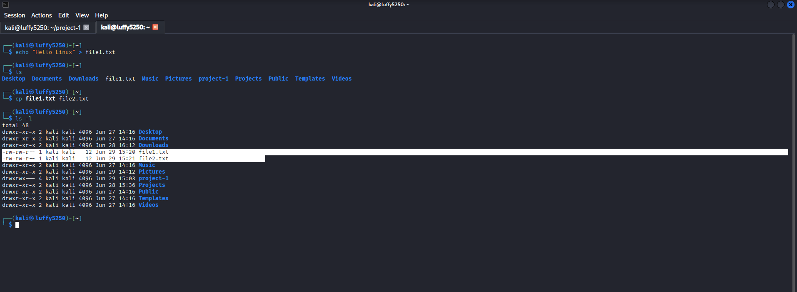

## 2. Move or Rename Files

### Command

```bash

mv file2.txt newfile.txt

```

### Description

The `mv` command helps me move or rename files. For example I can rename `file2.txt` to `newfile.txt`.

### Screenshot

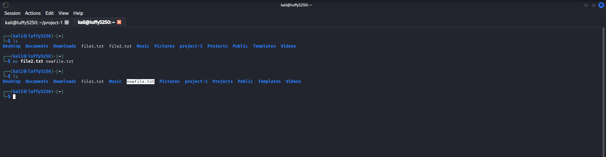

## 3. Remove Files

### Command

```bash

rm newfile.txt

```

### Description

To delete a file I use the `rm` command. For instance I can delete `newfile.txt` with this command.

### Screenshot

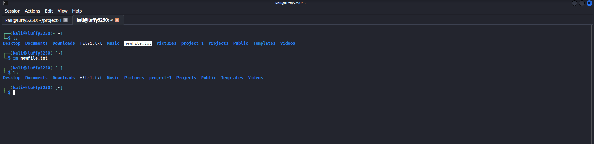

## 4. Display File Contents

### Command

```bash

cat sample.txt

```

### Description

The `cat` command is useful for displaying the contents of a file like `sample.txt`.

### Screenshot

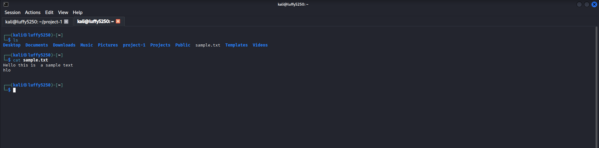

## 5. Display First 10 Lines

### Command

```bash

head sample.txt

```

### Description

I use `head` to see the 10 lines of a file such as `sample.txt`. This helps me quickly check the start of a file.

### Screenshot

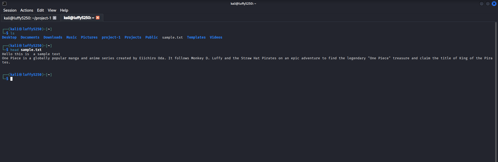

## 6. Display 10 Lines

### Command

```bash

tail sample.txt

```

### Description

The `tail` command shows me the last 10 lines of a file like `sample.txt`. This is helpful for checking the end of a file.

### Screenshot

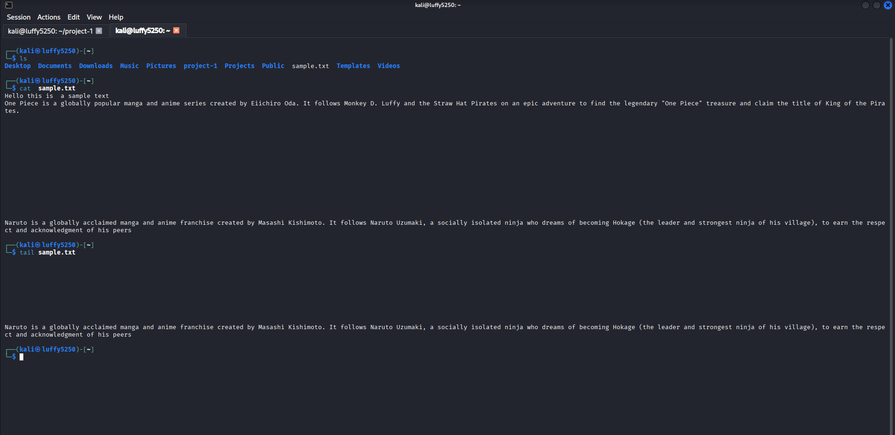

## 7. Count File Statistics

### Command

```bash

wc sample.txt

```

### Description

With `wc` I can see the number of lines, words and characters in `sample.txt`. This gives me an overview of the files content.

### Screenshot

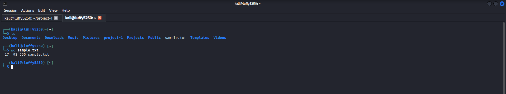

## 8. Search Text in a File

### Command

```bash

grep "Linux" sample.txt

```

### Description

The `grep` command helps me search for text like "Linux" in a file named `sample.txt`.

### Screenshot

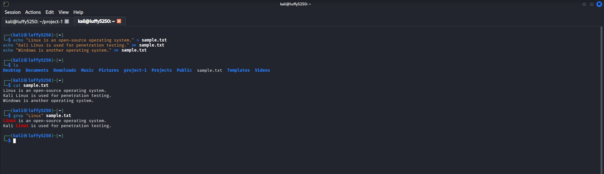

## 9. Display File with Line Numbers

### Command

```bash

nl sample.txt

```

### Description

I use `nl` to display the contents of `sample.txt` with line numbers. This makes it easier to reference lines.

### Screenshot

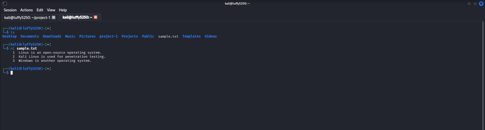

## 10. Clear the Terminal Screen

### Command

```bash

```

### Description

The `clear` command clears the terminal screen. This helps keep my workspace tidy.

### Screenshot

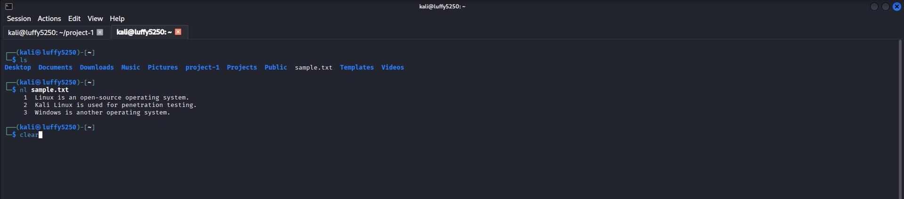

#conclusion

In this part I learned how to:

- Use `cp` to copy files

- Use `mv` to move and rename files

- files with `rm`

- Display file contents using `cat`

- View the start and end of files with `head` and `tail`

- Count lines, words and characters in a file using `wc`

- Search for text in a file with `grep`

- Display line numbers, in a file using `nl`

- Clear the terminal screen with `clear`


--------------------------------------------------------------------------------------------------------------------------------------------------------------------------------------------------------------------------------------

# Part 5 – File Searching And Disk Usage

## 1. Search For Files

### Command

```bash

find. -Name "*.txt"

```

### Description

I can use this command to search for all my text files with the extension in the current directory and its subdirectories. This is really useful when I need to find a file. The File Searching command is very helpful for this. I use File Searching to look for my files.

### Screenshot

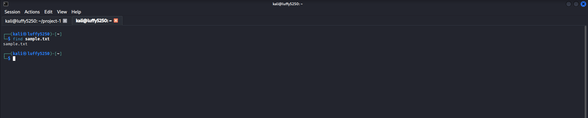

---

## 2. Locate A Command

### Command

```bash

which python3

```

### Description

When I need to know where a certain program is located I use the Locate Command. The Locate Command helps me find the location of the python3 executable. This is useful when I need to know where my programs are.

### Screenshot

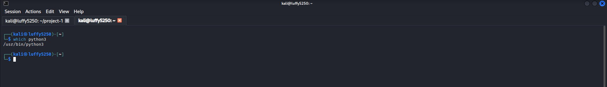

---

## 3. Display Disk Usage

### Command

```bash

df -h

```

### Description

To check how space I have left on my disk I use the Display Disk Usage command. The Display Disk Usage command shows me the disk space usage in a way that's easy to understand. I use Display Disk Usage to check my disk space.

### Screenshot

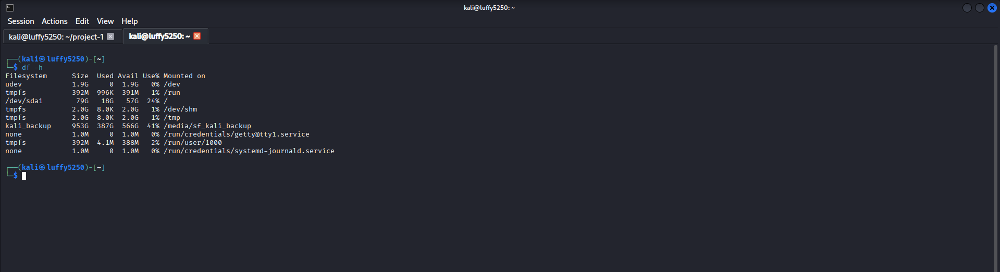

---

## 4. Display Directory Size

### Command

```bash

du -sh.

```

### Description

I can check the size of the current directory using the Display Directory Size command. The Display Directory Size command is useful when I need to know how space a directory is taking up. I use Display Directory Size to check the size of my directories.

### Screenshot

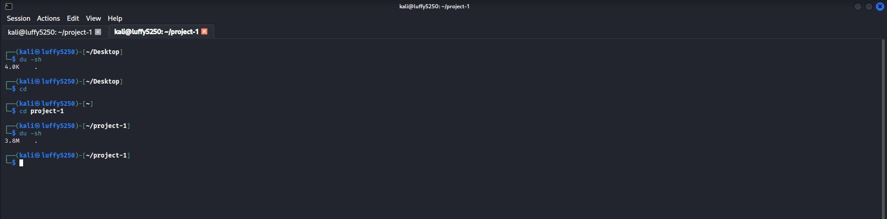

---

## 5. Display Calendar

### Command

```bash

cal

```

### Description

The Display Calendar command shows me the months calendar. I use the Display Calendar command when I need to check the dates. The calendar is very helpful for planning.

### Screenshot

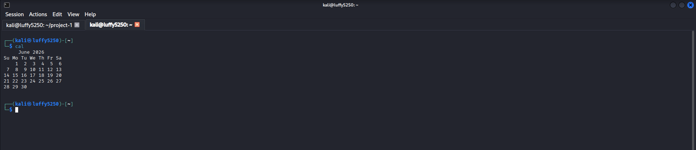

---

## 6. Display Current Date And Time

### Command

```bash

date

```

### Description

To check the date and time I use the Display Current Date And Time command. The Display Current Date And Time command shows me the system date and time. I use Display Current Date And Time to check the time.

### Screenshot

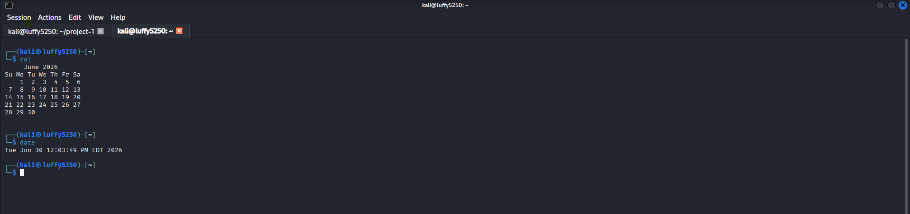

---

## 7. Display Command History

### Command

```bash

history

```

### Description

The Display Command History command shows me all the commands I have used before. I use the Display Command History command when I need to remember what I did earlier. The command history is very useful for this.

### Screenshot

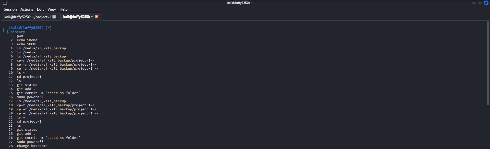

---

## 8. Display Running Processes

### Command

```bash

ps

```

### Description

To check which processes are currently running I use the Display Running Processes command. The Display Running Processes command shows me the processes that are running for the user. I use Display Running Processes to check the processes.

### Screenshot

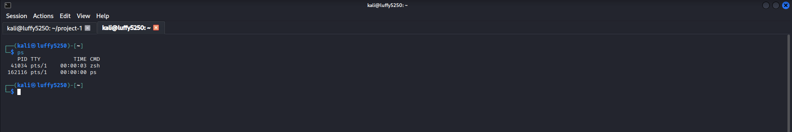

---

## 9. Monitor System Processes

### Command

```bash

top

```

### Description

The Monitor System Processes command shows me real-time information about the processes and system resources. I use the Monitor System Processes command when I need to check the system resources. The Monitor System Processes command is very helpful for monitoring the system.

### Screenshot

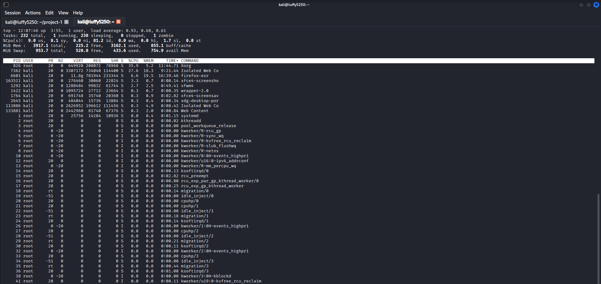

---

## 10. Exit The Terminal

### Command

```bash

exit

```

### Description

When I am done using the terminal I use the Exit The Terminal command to close the session. The Exit The Terminal command is useful when I need to exit the terminal. I use Exit The Terminal to exit.

### Screenshot

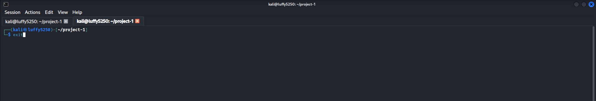

---

# Conclusion

In this part, I learned how to:

- Search for files using `find`
- Locate executable programs using `which`
- Check disk usage using `df`
- Check directory size using `du`
- View the calendar using `cal`
- Display the current date and time using `date`
- View command history using `history`
- Display running processes using `ps`
- Monitor system resources using `top`
- Exit the terminal using `exit`


-------------------------------------------------------------------------------------------------------------------------------------------------------------------------------------------------------


# Part 6 – Archiving, Compression & Links

## 1. Create a ZIP Archive

### Command

```bash

zip files.zip sample.txt

```

### Description

I can create a ZIP archive with a file in it. This is done with a command.

### Screenshot

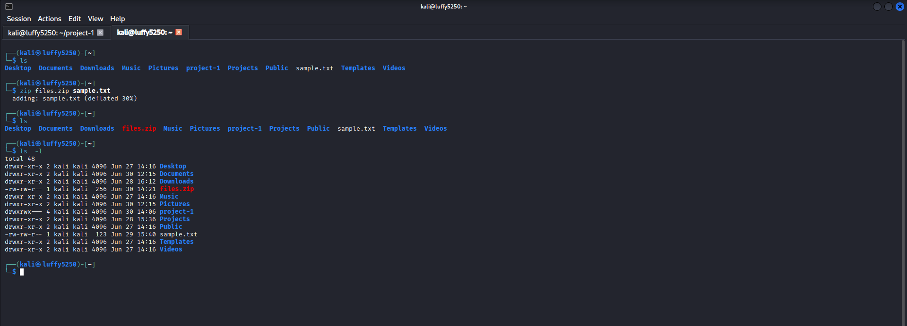

## 2. Extract a ZIP Archive

### Command

```bash

unzip files.zip

```

### Description

To get the file back I use the command. It extracts the ZIP archive.

### Screenshot

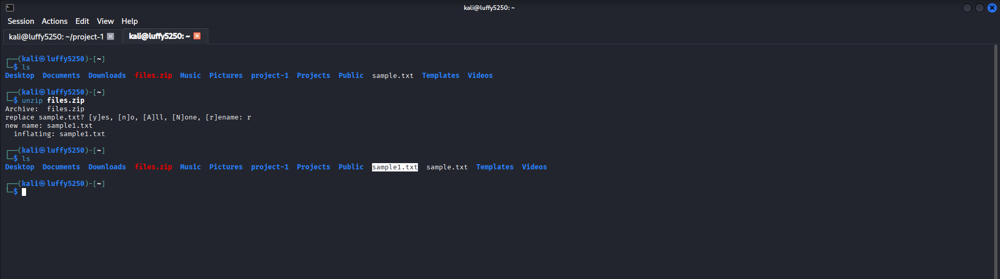

## 3. Create a TAR Archive

### Command

```bash

tar -cvf archive.tar sample.txt

```

### Description

A TAR archive is another type of archive. I create it with the tar command and the file I want.

### Screenshot


## 4. Extract a TAR Archive

### Command

```bash

tar -xvf archive.tar

```

### Description

The tar command with an option helps me extract the TAR archive.

### Screenshot

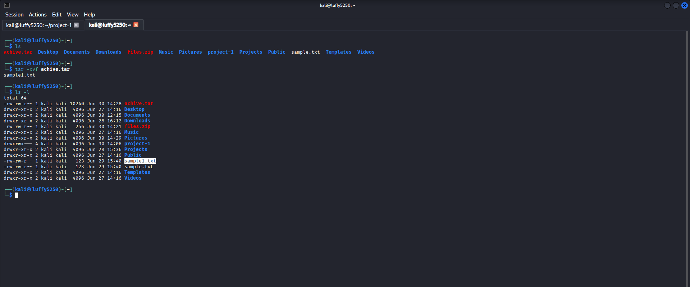

## 5. Compress a File Using gzip

### Command

```bash

gzip sample.txt

```

### Description

gzip is a tool to compress files. I use it to make my file smaller.

### Screenshot

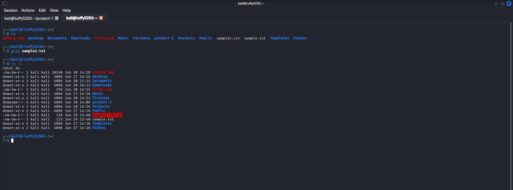

## 6. Decompress a Gzip File

### Command

```bash

gunzip sample.txt.gz

```

### Description

When I want my file back I use gunzip. It decompresses the gzip file.

### Screenshot

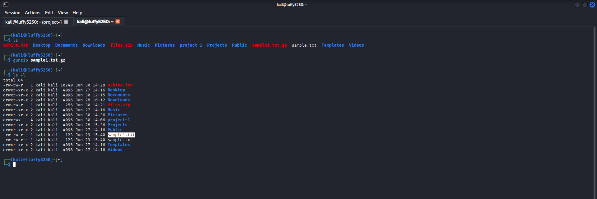

## 7. Create a Hard Link

### Command

```bash

sample.txt hardlink.txt

```

### Description

A hard link is like a copy of a file. I create it with the command.

### Screenshot

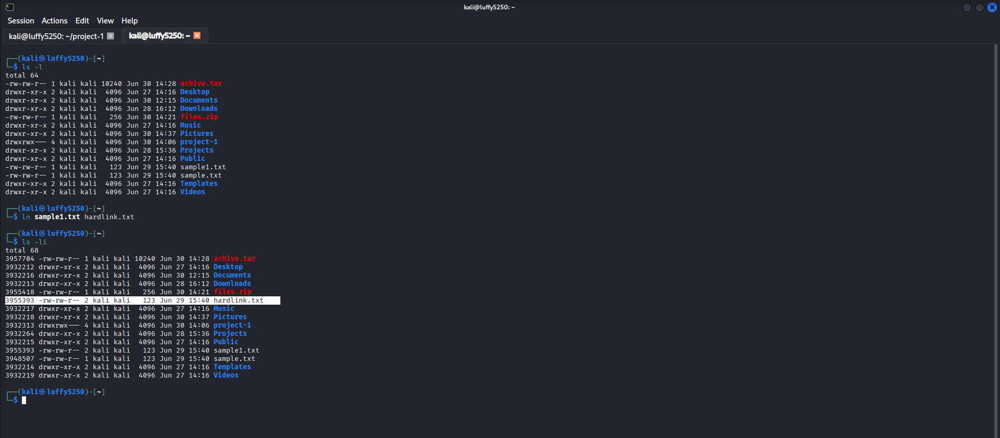

## 8. Create a Symbolic Link

### Command

```bash

ln -s sample.txt softlink.txt

```

### Description

A symbolic link points to a file. The ln command with an option creates it.

### Screenshot

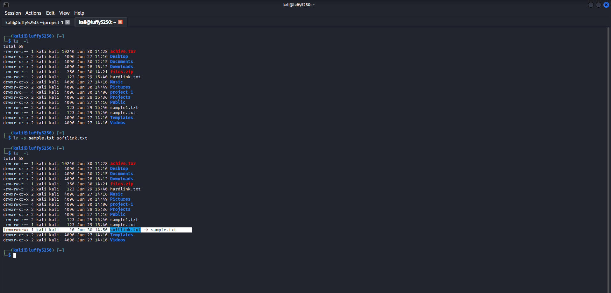

## 9. Display File Type

### Command

```bash

file sample.txt

```

### Description

I can see what type of file I have. The file command tells me.

### Screenshot

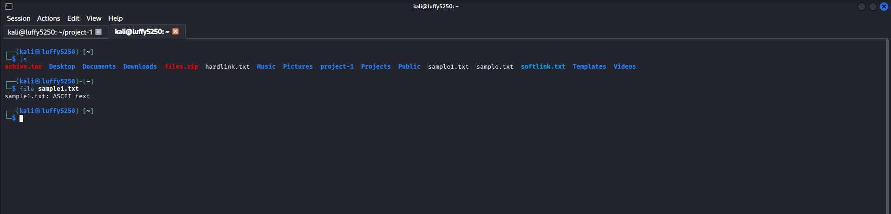

## 10. Compare Two Files

### Command

```bash

diff file1.txt file2.txt

```

### Description

The diff command shows me the differences between two files.

### Screenshot

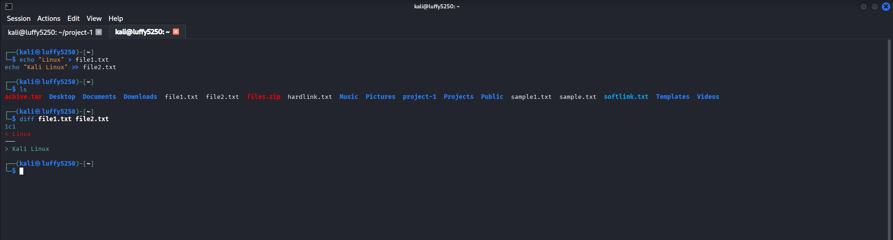

#conclusion

In this part, I learned how to:

- Create ZIP archives using `zip`.
- Extract ZIP archives using `unzip`.
- Create TAR archives using `tar -cvf`.
- Extract TAR archives using `tar -xvf`.
- Compress files using `gzip`.
- Decompress files using `gunzip`.
- Create hard links using `ln`.
- Create symbolic (soft) links using `ln -s`.
- Identify file types using the `file` command.
- Compare files using the `diff` command.


-----------------------------------------------------------------------------------------------------------------------------------------------------------------------------


# Part 7 – File Permissions & Ownership

## 1. Display File Permissions in Numeric Format

### Command

```bash

stat sample.txt

```

### Description

The `stat` command shows you all the details about a file like what permissions it has, how big it's who owns it and when it was last changed.

### Screenshot


---

## 2. Change File Permission to Read, Write and Execute for Owner

### Command

```bash

chmod 700 sample.txt

```

### Description

When you use the `chmod 700` command on a file like `sample.txt` you are giving the owner of the file the ability to read, write and execute it. Nobody else has any permissions.

### Screenshot


---

## 3. Change File Permission to Read and Write for Owner Read for Others

### Command

```bash

chmod 644 sample.txt

```

### Description

The `chmod 644` command gives the owner of the file `sample.txt` the ability to read and write and it gives everyone the ability to read the file.

### Screenshot


---

## 4. Change Group Ownership

### Command

```bash

chgrp kali sample.txt

```

### Description

If you want to change the group that owns a file you can use the `chgrp` command. You specify the new group, like `kali` and the file like `sample.txt`.

### Screenshot


---

## 5. Display Access Control List (ACL)

### Command

```bash

getfacl sample.txt

```

### Description

To see the Access Control List or ACL for a file you use the `getfacl` command. It shows you all the permissions for the file, including who can read, write and execute it.

### Screenshot


---

## 6. Change File Modification Time

### Command

```bash

touch -m sample.txt

```

### Description

If you want to update the time a file was last modified you can use the `touch -m` command. It changes the modification time to the current time.

### Screenshot


---

## 7. Change File Access Time

### Command

```bash

touch -a sample.txt

```

### Description

The `touch -a` command updates the time a file was last accessed which's useful for keeping track of when files are being used.

### Screenshot


---

## 8. Display File Timestamp

### Command

```bash

--full-time sample.txt

```

### Description

To see all the details about when a file was modified, accessed and changed you can use the `ls --full-time` command and it shows you the timestamps in a format that is easy to read.

### Screenshot


---

## 9. Display Files Sorted by Modification Time

### Command

```bash

ls -lt

```

### Description

If you want to see a list of files sorted by when they were modified you can use the `ls -lt` command and it shows you the most recently modified files first.

### Screenshot


---

## 10. Display Files Sorted by Size

### Command

```bash

ls -lhS

```

### Description

To see a list of files sorted by their size you can use the ` -lhS` command and it shows you the largest files first with the sizes displayed in a way that is easy to understand.

### Screenshot


---

#

In this part I learned how to do a lot of things with files like:

- Display file information using the `stat` command.

- Change file permissions using the `chmod 700` command.

- Change file permissions using the `chmod 644` command.

- Change group ownership using the `chgrp` command.

- View Access Control Lists using the `getfacl` command.

- Update the modification time using the `touch -m` command.

- Update the access time using the `touch -a` command.

- View detailed timestamps using the `ls --full-time` command.

- Sort files by modification time using the `ls -lt` command.

- Sort files, by size using the `ls -lhS` command.


-------------------------------------------------------------------------------------------------------------------------------------------------------------------------------------------------------------------


# Part 8 – Package Management

## 1. Update Package List

### Command

```bash

sudo update

```

### Description

This command updates the package list from the configured repositories. It helps to get the package information.

### Screenshot

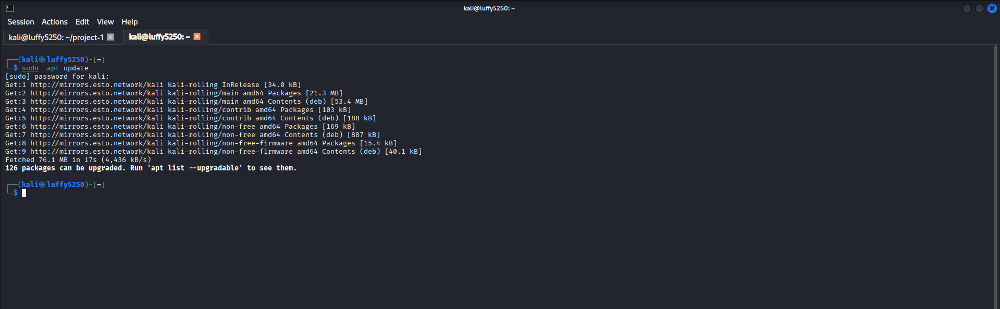

## 2. Upgrade Installed Packages

### Command

```bash

sudo apt upgrade

```

### Description

The ` upgrade` command upgrades all installed packages to their latest available versions. This keeps the system up to date.

### Screenshot

sudo apt upgrade may upgrade hundreds of packages so screenshot is full not possiable

## 3. Search for a Package

### Command

```bash

search nmap

```

### Description

To find packages related to `nmap` use the `apt search nmap` command. It searches the package repository.

### Screenshot

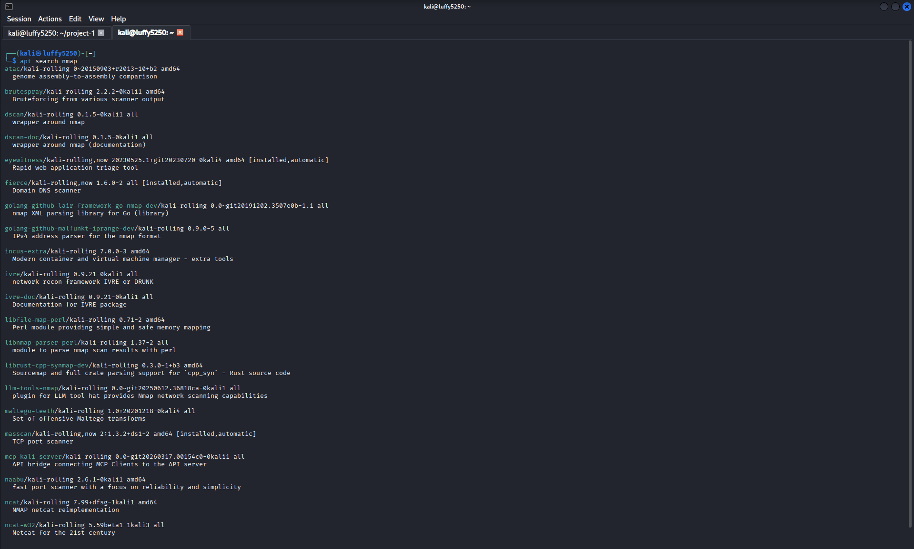

## 4. Display Package Information

### Command

```bash

apt show nmap

```

### Description

The `apt show nmap` command displays information about the `nmap` package. It helps to know more about the package.

### Screenshot

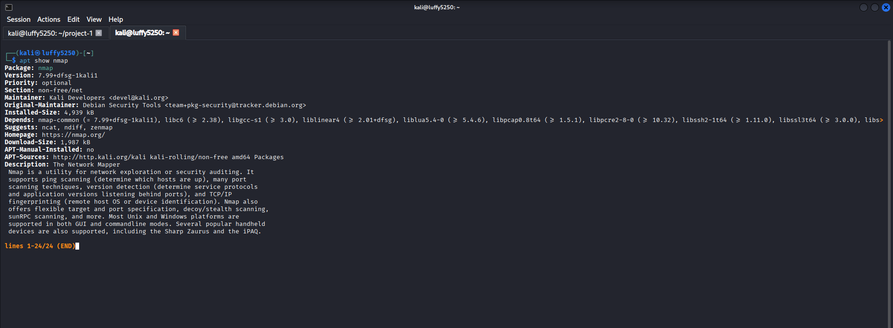

## 5. Install a Package

### Command

```bash

sudo install tree

```

### Description

To install the `tree` package use the `sudo apt install tree` command. It installs the package from the repository.

### Screenshot

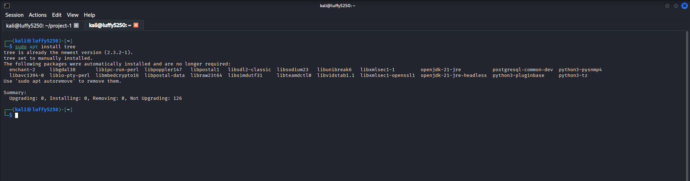

## 6. Verify Installed Package

### Command

```bash

tree --version

```

### Description

The `tree --version` command displays the installed version of the `tree` utility. It helps to verify the installation.

### Screenshot

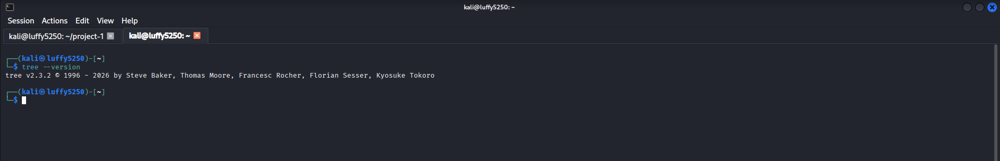

## 7. Remove a Package

### Command

```bash

sudo apt remove tree

```

### Description

To remove the installed `tree` package use the `sudo remove tree` command.

### Screenshot

It removes the  software 

## 8. Remove Packages

### Command

```bash

sudo apt autoremove

```

### Description

The `sudo apt autoremove` command removes packages that were automatically installed. Are no longer required.

### Screenshot

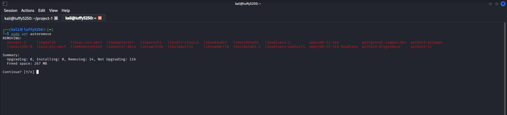

## 9. Clean Downloaded Package Cache

### Command

```bash

sudo clean

```

### Description

To clean the downloaded package files from the local cache use the `sudo apt clean` command.

### Screenshot

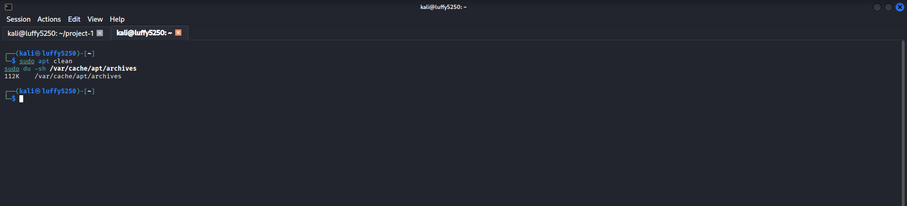

## 10. Display Installed Package List

### Command

```bash

list --installed

```

### Description

The `apt list --installed` command displays a list of all installed packages on the system.

### Screenshot

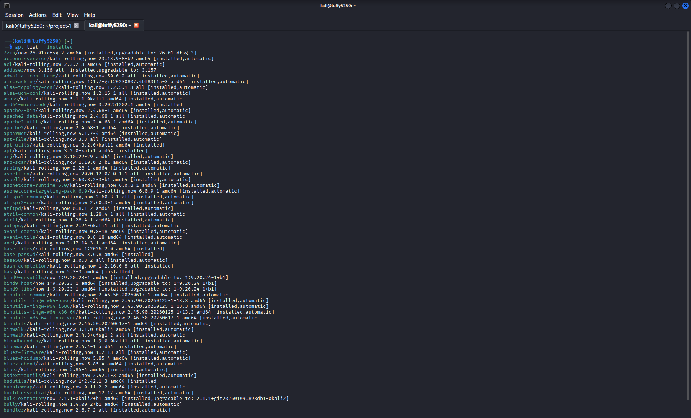

#

In this part I learned how to manage packages using various `apt` commands.

- I used ` update` to update the package list.

- I used ` upgrade` to upgrade installed packages.

- I used ` search` to search for packages like `nmap`.

- I used ` show` to display information about packages like `nmap`.

- I used ` install` to install packages like `tree`.

- I used `tree --version` to verify the installed version of `tree`.

- I used ` remove` to remove packages, like `tree`.

- I used ` autoremove` to remove unused packages.

- I used ` clean` to clean the package cache.

- I used ` list --installed` to display installed packages.


