# CEH project-1 - Linux and Network Reconnaissance


##  1. whoami

### command :
          whoami

### output :
         luffy5250

### screenshots :

  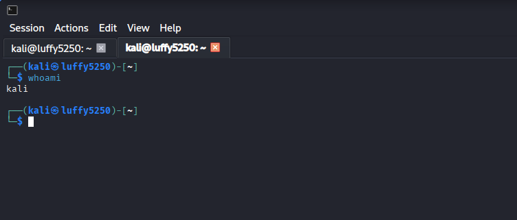

                                                                                                                                                                                                                                             
### Explanation :
         This displays the username of the currently logged-in user


## 2. id 

### command : 
          id 

### output : 
         uid=1000(luffy5250) gid=1000(luffy5250) groups=1000(luffy5250),4(adm),20(dialout),24(cdrom),25(floppy),27(sudo),29(audio),30(dip),44(video),46(plugdev),100(users),101(netdev),102(scanner),112(bluetooth),117(lpadmin),119(wireshark),123(vboxsf),124(kaboxer)

### screenshots :

  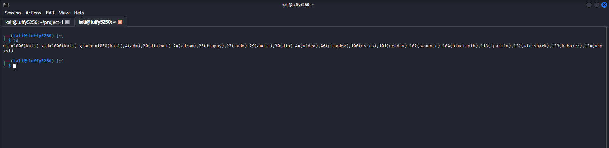


### Explanation : 
              This shows the User ID (UID),Group ID (GID), and group membership.


## 3. hostname 

### command :
       ```bash
       hostname
      ```
### output :
       ```text
       kali
      ```
### screenshots :

  


### Explanation :
         Displays the name of the computer on the network.

## 4. hostctl

### command :
        ```bash 
        hostnamectl
          ```
### output : 
```text  
 Static hostname: kali
       Icon name: computer-vm
         Chassis: vm 💽
      Machine ID: edc1f06e1bb9409fb6a2d76f2ed63587
         Boot ID: 5448050857cf475c85006c89596d1073
  Virtualization: oracle
Operating System: Kali GNU/Linux Rolling   
          Kernel: Linux 6.19.14+kali-amd64
    Architecture: x86-64
 Hardware Vendor: innotek GmbH
  Hardware Model: VirtualBox
Hardware Version: 1.2
Firmware Version: VirtualBox
   Firmware Date: Fri 2006-12-01
    Firmware Age: 19y 6month 3w 4d 
  ```
### screenshots :

  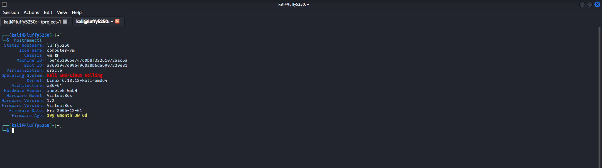


### Explanation :
            Diapays detailed system and hostnames information
              shows the Hostname,operating system,kernel version and system architecture.


## 5. Kernel Information

### Command
```bash
uname -a
```
### output :
      Linux luffy5250 6.18.12+kali-amd64 #1 SMP PREEMPT_DYNAMIC Kali 6.18.12-1kali1 (2026-02-25) x86_64 GNU/Linux

### screenshots :

  


### Explanation :
      Displays detailed information about the Linux kernel and system architecture.

         
                                                                                                               
## 6. Operating System Details

### Command
```bash
cat /etc/os-release
```

### output : 
      PRETTY_NAME="Kali GNU/Linux Rolling"
      NAME="Kali GNU/Linux"
      VERSION_ID="2026.2"
      VERSION="2026.2"
      VERSION_CODENAME=kali-rolling
      ID=kali
      ID_LIKE=debian
      HOME_URL="https://www.kali.org/"
      SUPPORT_URL="https://forums.kali.org/"
      BUG_REPORT_URL="https://bugs.kali.org/"
      ANSI_COLOR="1;31"

### screenshots :

  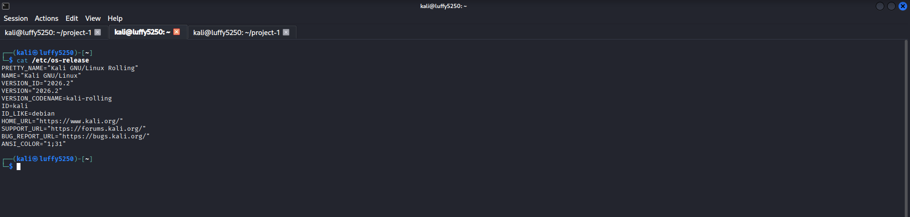


### Explanation :
     Displays detailed information about the installed Linux distribution.

                                                                                                                                                                                                                                            


## Skills Learned
    Basic Linux commands
    User identification
    System identification
    Operating system information
    Kernel information


--------------------------------------------------------------------------------------------------------------------


# Part 2 – Linux Files and Directories

## 1. Present Working Directory

### Command
```bash
pwd
```

### Explanation
Shows the current working directory.

### Screenshot


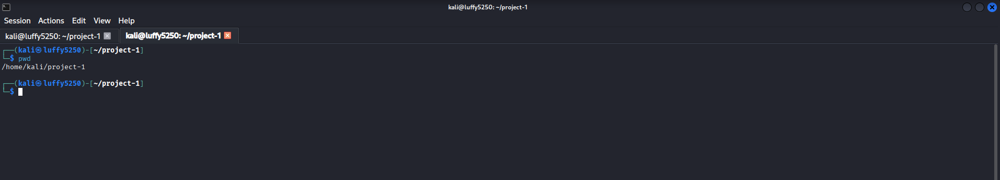


## 2. List Files and Directories

### Command
```bash
ls
```

### Explanation
Lists the files and directories in the current location.

### Screenshot

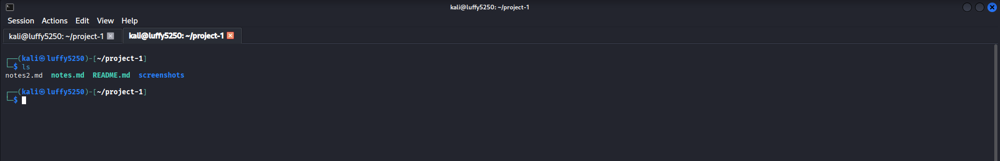


## 3. List Files with Details

### Command
```bash
ls -l
```

### Explanation
Shows files and directories in detail, including:
- Permissions
- Owner
- Group
- File size
- Date and time
- File name

### Screenshot

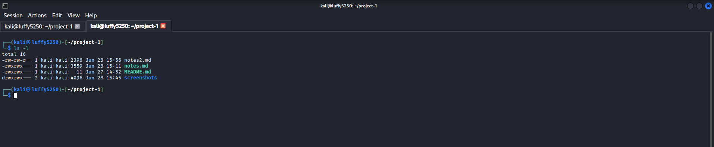


## 4. List All Files (Including Hidden Files)

### Command
```bash
ls -la
```

### Explanation
Shows all files, including hidden ones, with detailed information.

### Screenshot

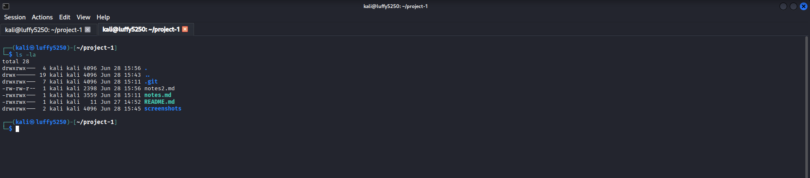


## 5. Change Directory

### Command
```bash
cd <directory_name>
```

### Example
```bash
cd Documents
```

### Explanation
Changes the current working directory.

### Screenshot

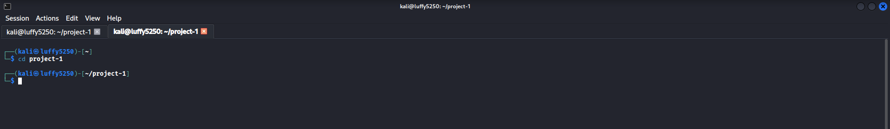


## 6. Go Back One Directory

### Command
```bash
cd ..
```

### Explanation
Moves to the parent directory.

### Screenshot

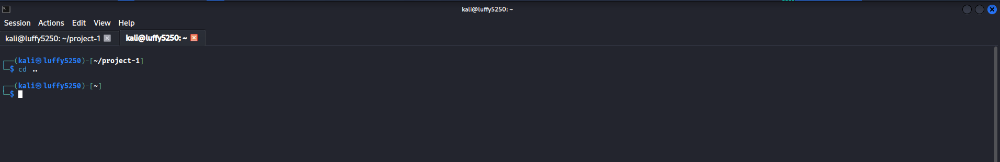


## 7. Go to Home Directory

### Command
```bash
cd
```

### Explanation
Returns to the user's home directory.

### Screenshot

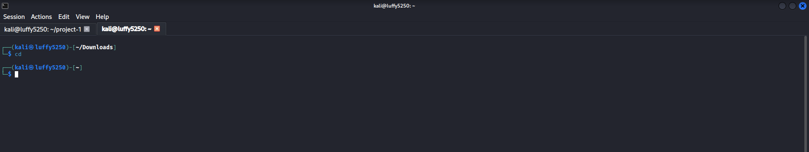


## 8. Create a Directory

### Command
```bash
mkdir test_folder
```

### Explanation
Creates a new directory called `test_folder`.

### Screenshot

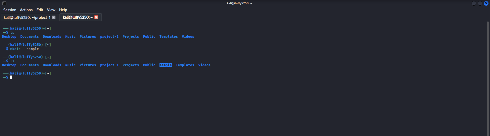


## 9. Remove an Empty Directory

### Command
```bash
rmdir test_folder
```

### Explanation
Deletes an empty directory.

### Screenshot

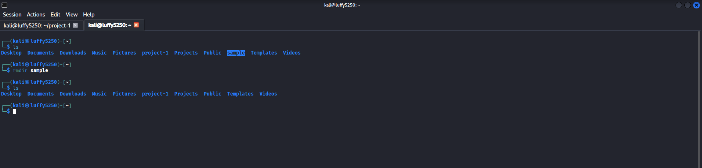


## 10. Create a File

### Command
```bash
touch file.txt
```

### Explanation
Creates a new empty file called `file.txt`.

### Screenshot

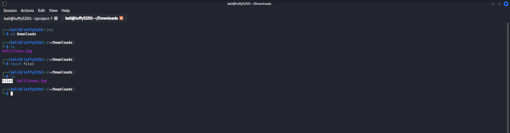


## Summary

 Command | Purpose  |

  `pwd` | Shows current directory |
  `ls` | Lists files and directories |
  `ls -l` | Lists files with detailed information |
  `ls -la` | Lists all files, including hidden ones |
  `cd` | Changes directory |
  `cd ..` | Moves to the parent directory |
  `cd` | Goes to the home directory |
  `mkdir` | Creates a new directory |
  `rmdir` | Removes an empty directory |
  `touch` | Creates a new file |


-------------------------------------------------------------------------------------------------------------------------------


# Part 3 – System And Kernel Information

## 1. See Who Is Logged In

To see who is logged in to the system you can use the who command.

This command is very useful because it shows you the users currently logged into the system.

You can use this command to find out who is using the system.

### Command

```bash

who

```

### Description

The who command displays the users currently logged into the system.

This is the Linux kernel way of showing you the users.

### Screenshot

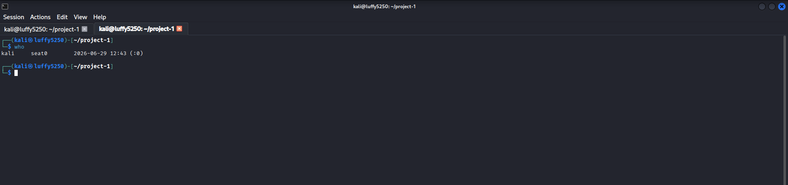

---

## 2. See Usernames Of Logged-in Users

To see the usernames of users currently logged into the system you can use the users command.

This command is very useful because it shows you the usernames of users currently logged into the system.

You can use this command to find out the usernames of users.

### Command

```bash

users

```

### Description

The users command displays the usernames of users currently logged into the system.

This is the Linux kernel way of showing you the usernames of users.

### Screenshot

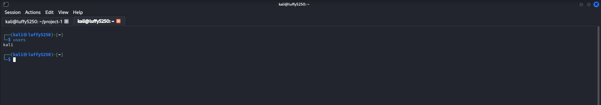

---

## 3. See Kernel Name

To see the name of the Linux kernel you can use the uname -s command.

This command is very useful because it shows you the name of the Linux kernel.

You can use this command to find out the name of the Linux kernel.

### Command

```bash

uname -s

```

### Description

The `uname -s` command displays the name of the Linux kernel.

This is the Linux kernel way of showing you the name of the kernel.

### Screenshot


---

## 4. See Kernel Version

To see the version of the running Linux kernel you can use the uname -r command.

This command is very useful because it shows you the version of the Linux kernel.

You can use this command to find out the version of the Linux kernel.

### Command

```bash

uname -r

```

### Description

The `uname -r` command displays the version of the running Linux kernel.

This is the Linux kernel way of showing you the version of the kernel.

### Screenshot

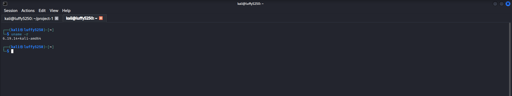

---

## 5. See Machine Architecture

To see the hardware architecture of the system you can use the uname -m command.

This command is very useful because it shows you the hardware architecture of the system.

You can use this command to find out the hardware architecture.

### Command

```bash

uname -m

```

### Description

The `uname -m` command displays the hardware architecture of the system.

This is the Linux kernel way of showing you the hardware architecture.

### Screenshot

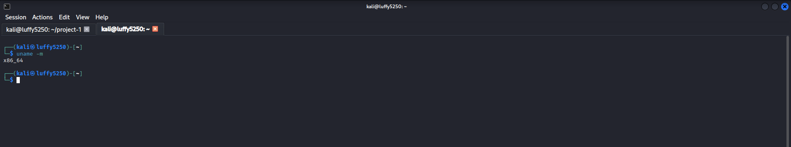

---

## 6. See Processor Type

To see the processor type you can use the uname -p command.

This command is very useful because it shows you the processor type.

You can use this command to find out the processor type.

### Command

```bash

uname -p

```

### Description

The `uname -p` command displays the processor type.

This command may return "unknown" on some systems.

### Screenshot

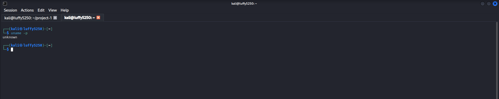

---

## 7. See Hardware Platform

To see the hardware platform you can use the uname -i command.

This command is very useful because it shows you the hardware platform.

You can use this command to find out the hardware platform.

### Command

```bash

uname -i

```

### Description

The `uname -i` command displays the hardware platform.

This command may return "unknown" on some systems.

### Screenshot

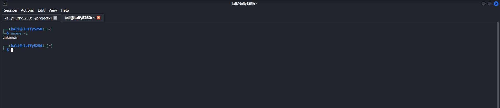

---

## 8. See Kernel Release Information

To see the Linux kernel version and compiler information you can use the cat /proc/version command.

This command is very useful because it shows you the Linux kernel version and compiler information.

You can use this command to find out the Linux kernel version and compiler information.

### Command

```bash

cat /proc/version

```

### Description

The `cat /proc/version` command displays the Linux kernel version and compiler information.

This is the Linux kernel way of showing you the kernel version and compiler information.

### Screenshot

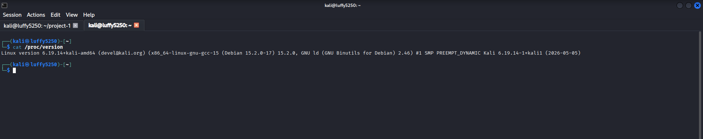

---

## 9. See CPU Information

To see information about the CPU architecture you can use the lscpu command.

This command is very useful because it shows you detailed information about the CPU architecture.

You can use this command to find out the CPU information.

### Command

```bash

lscpu

```

### Description

The `lscpu` command displays information about the CPU architecture.

This is the Linux kernel way of showing you the CPU information.

### Screenshot

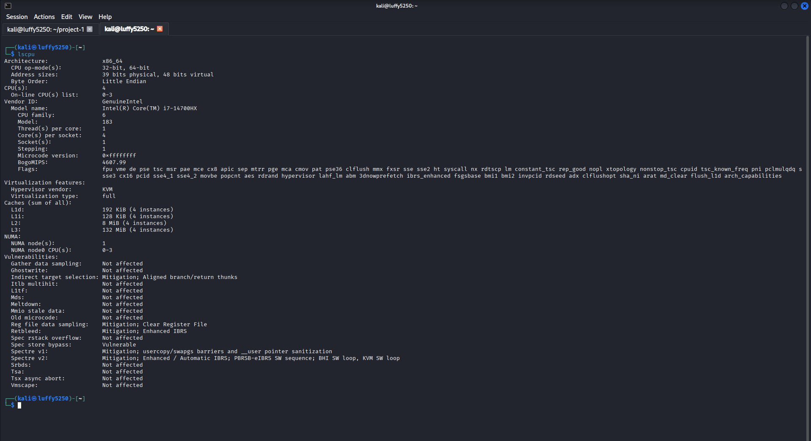

---

## 10. See Memory Information

To see system memory usage in a readable format you can use the free -h command.

This command is very useful because it shows you system memory usage in a readable format.

You can use this command to find out the memory information.

### Command

```bash

free -h

```

### Description

The `free -h` command displays system memory usage, in a readable format.

This is the Linux kernel way of showing you the memory information.

### Screenshot

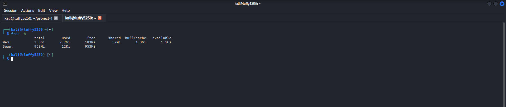

---

#

In this part I learned how to:

- View logged-in users using the `who` and `users` commands

- Check kernel name, version, processor and architecture using the `uname` command

- View kernel details using the `cat /proc/version` command

- Display CPU information using the `lscpu` command

- Display memory usage using the `free -h` command

I learned about the Linux kernel and system information commands like `who` `users` `uname` `cat /proc/version` `lscpu` and `free -h`.
